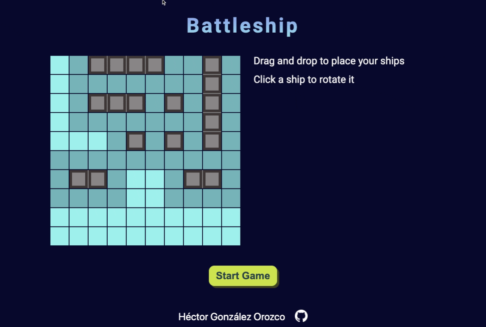

# Battleship Game

Built as part of [The Odin Project](https://www.theodinproject.com/) curriculum.

A recreation of the classic Battleship game in vanilla Javascript

The player can place their ships by dragging and dropping them in the board, and then plays by selecting a square in the opponent's board.

This project is made as a way to practice TDD using [Jest](https://jestjs.io/) to test the game board, player and ship objects.

By [Héctor González Orozco](https://github.com/hectorgonzalezo)

## :computer: Built With

* [JavaScript](https://www.javascript.com/)
* [Jest](https://jestjs.io/)
* [Webpack](https://webpack.js.org/)

## :ferris_wheel: Live Preview

[https://hectorgonzalezo.github.io/battleship/](https://hectorgonzalezo.github.io/battleship/)

## :rocket: Features

- Drag an drop interface to place ships in gameboard.

- Opponent's gameboard is greyed out, hitting a square by clicking on it shows its contents.

- If a player hits a ship, they can continue playing.

- AI opponent that chooses adjacent squares after successfully hitting a ship.

- Placement of boards is responsive on big screens.

- 2 responsive mobile versions available, depending on screen size.

## :construction: Installing

1. Clone the repository

`git clone https://github.com/hectorgonzalezo/battleship`

2. Install dependencies

`npm install`

4. Start the development server

`npm start`

Use webpack to bundle and compile code by running:

`npm run build`

Or in real time after any change in code with:

`npm run watch`

## :white_check_mark: Tests

The game is thoroughly tested. To run all rests use:

`npm test`

## :camera: Sneak Peek

## Acknowledgements

- Favicon by [Icons8](https://icons8.com).

